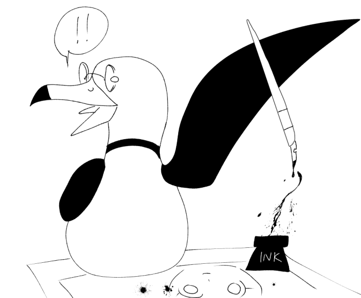

# Panelists

##  Alexander Wallace

Alexander Wallace is an alternate historian, reader, writer, and 2019 William & Mary graduate who moderates the [Alternate History Online](https://www.facebook.com/groups/2208892565) group on Facebook and the [Alternate Timelines Forum](https://alternate-timelines.com/) on Proboards. He writes regularly for the [Sea Lion Press](https://www.sealionpress.co.uk/blog/categories/alexander-wallace) blog, [NeverWas](https://neverwasmag.com/author/alexander-wallace/) magazine, and Warped Factor, and also appears regularly on the [Alternate History Show with Ben Kearns](https://anchor.fm/ben-kearns/episodes/The-Alternate-History-Show-Episode1-World-War-II-el2fr3). He is a member of several alternate history fora under the name 'SpanishSpy.'

## Michael Thompson

Michael Thompson is an award-winning author and illustrator from Northern Virginia. 
He began his career at thirteen with the publication of his action-packed illustrated chapter book series, Chicken Boy. His debut YA portal fantasy novel, World of the Orb, earned national acclaim in the Feathered Quill Book Awards, alongside his folkloric fantasy / sea adventure Winslow Hoffner's Incredible Encounters. Michael's most recent publication, Chicken Boy and the Might of the Monkey Man, marks a triumphant return to his first-ever superhero series. 
Michael continues to produce fast-paced storytelling in diverse mediums, sharing the theme of plunging ordinary characters into extraordinary situations, with emphases on humor, adventure, and heart. 
For more information and a complete list of Michael's award-winning works, visit: https://michaelthompsonbooks.com/

## Kevin Cuffe

Kevin Cuffe is a father, a sorcerer and a comic book author. When not podcasting with Bob Frantz or protecting the universe from malicious extra dimensional entities he is usually writing, playing D&D or watching AEW.
Website: [www.thewordbros.com](https://www.thewordbros.com)

## William & Mary Costuming Club

W&M’s own Costuming Club, affectionately known as “Cosplay Club” or “CosClub” among its members, is a student organization dedicated to the craft of cosplay and the nerdy culture surrounding it. Each year they travel the local convention circuit, putting on award-winning performances, hosting events, conducting workshops and photoshoots on campus, and often dressing up as Fred from Scooby Doo. Follow us on Instagram: [@wmcosclub](https://www.instagram.com/wmcosclub/)

## D.M. Patterson

D.M. Patterson is an author and editor for HCS Publishing and Director of their Children’s Literature department. While her heart is in picture books, she has published Steampunk short stories, poetry, and a romantic comedy novella. Patterson graduated with her MFA in Children’s Literature from Hollins University. Get to know her more, read some of her works in progress, and check out some amazing interviews of other authors on her website [dmpwrites.com](https://dmpwrites.com/).

## Emily MacKenzie

Emily MacKenzie is a sophomore majoring in Classical Archaeology at William & Mary. She is an active member of the Costuming Club, and occasionally attends meetings of Wizmug, Classics Club, and the Lambda Alliance. Their current nerdy obsession is Legend of Zelda: Skyward Sword, which takes up the majority of her fanworks, cosplay, and general free time. 

She will be presenting her panel "LGBTQ Subtext in the Legend of Zelda" as well as joining the Cosplay Club run panels "Cosplay During the Pandemic" and "Oh god, I put it on the Internet!", and will be helping with the Closet Cosplay Olympics. 

Instagram: [@cherrylavendercosplays](https://www.instagram.com/cherrylavendercosplays/?hl=en)
Discord: raging_dalek#2859

## 24x4

24x4 is a Korean American comic book and manga artist. They had a book considered for the 2020 Tezuka Award and are currently in the final round of judging for the SMA competition. They're addicted to Japanese competitions and are working on a manga publishing startup. (If you've got a portfolio/want to make manga, slide into their DMs.) 
They have prints, comics, and Jojos available, and are recently getting into doing commissions and comic book sketch covers. They like to draw superheros, fashion, and tropical stuff. They're hoping to start streaming drawing and digital painting on twitch next month. 

IG: [@24242424art](https://instagram.com/24242424art)

## Ama Adair
## Michele King
## Jefferson Grant Spears
##  Marcin "Alqua" Kłak
## Old Dominion Daleks
## The Scribbling Lion / Leona Wisoker
## Shay Merker
## Tara Moeller

## Want to be a Panelist?
[Complete this form!](https://forms.gle/7iqBM5Qnwz5mvKkF8)
